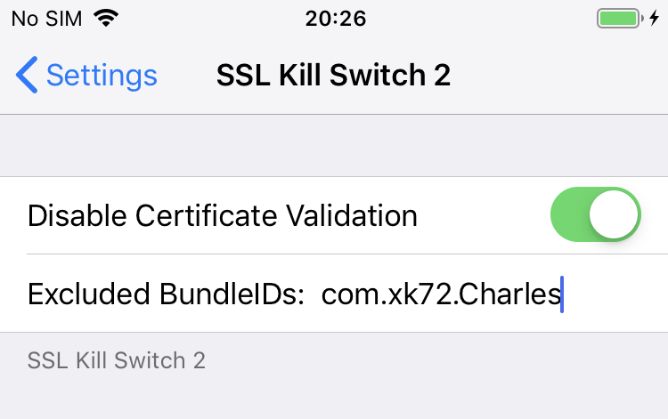

SSL Kill Switch 2
=================

Blackbox tool to disable SSL certificate validation - including certificate
pinning - within iOS and OS X Apps. Second iteration of
https://github.com/iSECPartners/ios-ssl-kill-switch .

Description
-----------

Once loaded into an iOS or OS X App, SSL Kill Switch 2 patches specific
low-level SSL functions within the Secure Transport API in order to override,
and disable the system's default certificate validation as well as any kind
of custom certificate validation (such as certificate pinning).

It was successfully tested against various Apps implementing certificate
pinning including the Apple App Store. The first version of SSL Kill Switch
was initially released at Black Hat Vegas 2012.

For more technical details on how it works, see
http://nabla-c0d3.github.io/blog/2013/08/20/ios-ssl-kill-switch-v0-dot-5-released/

iOS Instructions
----------------

On iOS, SSL Kill Switch 2 can be installed as a Cydia Subtrate tweak on a
jailbroken device.

### WARNING: THIS TWEAK WILL MAKE YOUR DEVICE INSECURE

Installing SSL Kill Switch 2 allows anyone on the same network as the device to
easily perform man-in-the-middle attacks against *any* SSL or HTTPS connection.
This means that it is trivial to get access to emails, websites viewed in Safari
and any other data downloaded by any App running on the device.

### Installation

The following dependencies should be installed using Cydia:

* Debian Packager
* Cydia Substrate
* PreferenceLoader

Then, download the latest pre-compiled package available in the release tab of
the SSL Kill Switch 2's GitHub page. Copy it to the device, install it and
respring the device:

    dpkg -i <package>.deb
    killall -HUP SpringBoard

There should be a new menu in the device's Settings where you can
enable the extension. Finally, kill and restart the App you want to test.

The tweak can later be uninstalled using:

    dpkg -r com.nablac0d3.SSLKillSwitch2

### Intercepting the App Store's traffic

Lots of people have asked about how to intercept the App Store's traffic using
SSL Kill Switch 2. I wrote down some instructions here but there are now outdated:
http://nabla-c0d3.github.io/blog/2013/08/20/intercepting-the-app-stores-traffic-on-ios/

### Intercepting with Charles Proxy

By default, SSL Kill Switch will disrupt the Charles Proxy iOS app and you will not be
able to proxy any network traffic with it. To fix this, add the Charles Proxy app
(com.xk72.Charles) to the list of excluded bundle IDs in the SSL Kill Switch config:

### Build

The build requires the Theos suite to be installed available at
http://www.iphonedevwiki.net/index.php/Theos/Getting_Started .

Then, within SSL Kill Switch 2's root foler, create a symlink to your theos
installation:

    ln -s /<path_to_your_theos_folder> theos

Make sure dpkg is installed. If you have Homebrew, use:

    brew install dpkg

Then, the SSL Kill Switch 2 Debian package can be built using:

    make package

OS X Instructions
-----------------

SSL Kill Switch 2 can be used in OS X Apps as a dynamic library to be injected into processes.

### WARNING: THIS HAS NOT BEEN TESTED ON RECENT VERSIONS OF MACOS

### Usage

On OS X, the SSLKillSwitch library needs to be manually injected into the process where
SSL pinning needs to be disabled. Once injected, it will automatically override and disable
SSL validation.

There are several ways to do this including:

* Starting the process with LLDB or in Xcode Debug->Attach to process then pause, and load SSLKillSwitch using `dlopen()`:

        (lldb) expr (void*)dlopen("/path/to/build/SSLKillSwitch.framework/Versions/A/SSLKillSwitch", 1)

  Expected result is a non-zero pointer:

        (void *) $1 = 0x00007f92e74d10c0

  If you receive a zero pointer then you may need to enable code-signing and build for profiling then use the binary in the release folder, and even may have to copy the binary to the app's resources folder. In which case you would have seen a sandbox read violation output to console. To test a new version of the binary you need to kill the app and load it in again.

* Using DYLD\_INSERT\_LIBRARIES to inject SSLKillSwitch and start the process.

### Restricted Apps

TBD

### Build

Use the Xcode project to build SSL Kill Switch 2 for OS X. The compiled library will then be
available in _Products/SSLKillSwitch.framework/Versions/A/SSLKillSwitch_. This is the binary
that you need to inject in the process where you want to disable SSL pinning.

Changelog
---------

* v0.14: Added support for iOS 13.
* v0.13: Added support for iOS 12.
* v0.12: Added support for iOS 11.
* v0.11: Added support for iOS 10.
* v0.10: Added support for proxy-ing [CocoaSPDY](https://github.com/twitter/CocoaSPDY) Apps (ie. Twitter iOS).
* v0.9: Extended the MobileLoader filter to simplify the proxy-ing of the Apple App Store application.
* V0.8: Added support for iOS 9.
* v0.7: Renamed tool to SSL Kill Switch 2; added support for OS X Apps and TrustKit.
* v0.6: Added support for iOS 7.
* v0.5: Complete rewrite in order to add support for proxy-ing Apple's App Store application.
* v0.4: Added hooks for SecTrustEvaluate().
* v0.3: Bug fixes and support for iOS 6.
* v0.2: Initial release.

License
-------

MIT - See ./LICENSE.

Author
------

Alban Diquet - @nabla_c0d3
